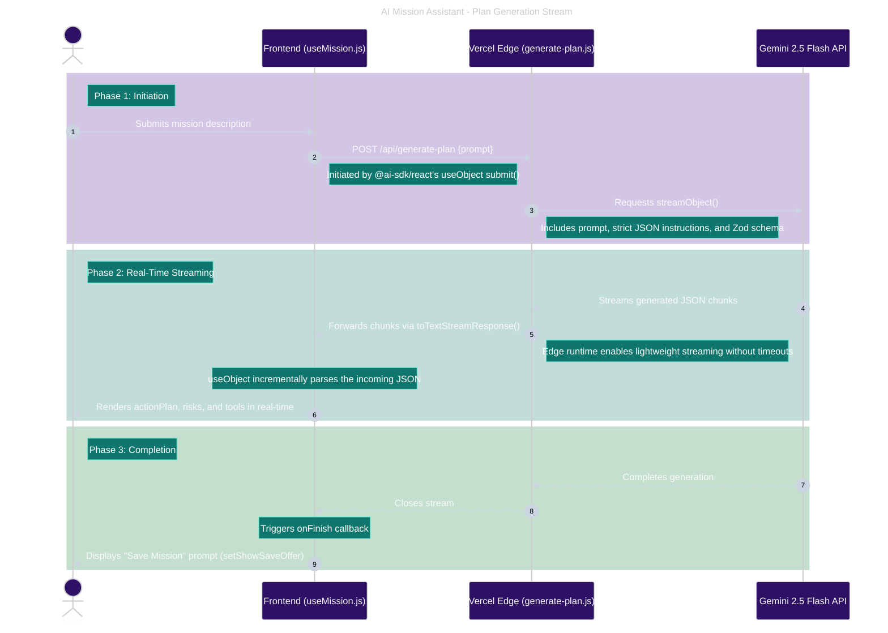

# AI Mission Assistant

  

AI Mission Assistant takes a plain-language goal and turns it into a structured breakdown: action steps, potential risks, and recommended tools. It's built on the Gemini 2.5 Flash API and the Vercel AI SDK.

This project is also where I've been documenting my own process as I build a full-stack app, continuing to make deliberate architectural choices, keep a human in the loop on AI-generated code, and treat AI as a consultant I check my work against rather than something I let drive.

## Demo / Gif

🔗 **Live Demo**: <https://ai-mission-assistant-demo.vercel.app>
🔗 Backend: <https://ai-mission-assistant-demo.onrender.com>

| Original Build: | Current Build: |
| --------------- | -------------- |
| <p align="center"></p> | <p align="center"></p> |

---

## Features

* **Mission Analysis**: Describe a goal in plain language and get back a structured breakdown of action steps, potential risks, and recommended tools.
* **Streaming Responses**: AI responses are streamed in real-time via Vercel Edge functions, preventing timeouts and providing immediate user feedback.
* **Mission History**: Past missions are saved to Postgres and can be reloaded for re-analysis.
* **Flexible Local Setup**: Database runs in Docker; the frontend and serverless API run through the Vercel CLI. See Known Limitations for a caveat on how this affects local testing.

---

## System Evolution

A few architectural changes worth calling out, mostly driven by things I ran into once the project moved past the prototype stage:

* **API Decoupling & Edge Migration**: Gemini API calls were decoupled from the Node.js/Express backend. I moved them to a Vercel Serverless Function using Edge Runtime. Requests were getting intermittently blocked, linked to Render's free-tier IP rotation landing on a blocked location, and a fixed IP wasn't available on free tier. Reduced cold-start was an extra perk.
* **Database Migration**: Moved from Supabase to Neon Postgres which is a better fit for how a low-traffic portfolio project actually gets used.
* **Monorepo Structure**: Vercel treats the `frontend` directory as the deployment root, which lets the serverless function ship alongside the Vite React app without a separate deploy pipeline for it.

---

## Architecture: Serverless API Flow

The diagram below shows what happens when a user submits a mission, specifically how the Gemini call is decoupled from the main Express backend and handled by its own Edge function.



The Express backend still handles the parts of the app that aren't AI calls, saving and retrieving missions from Postgres. The Edge function's only job is talking to Gemini and streaming that response back, which is why it lives separately from the rest of the API.

---

## AI Development Methodology

This project has also been a way for me to become more deliberate about how I use AI tools while building:

* **From Agent to Consultant**: I started out heavily using Cursor as a lead agent generating most of the code. I've since moved to VS Code, using Gemini Pro Extended more like a consultant I bring specific questions to, and Leo AI (Brave) for quick documentation lookups and cross-checking.
* **Human-in-the-Loop (HITL)**: I manually verify every line of AI-suggested code and architectural decision before it is applied.
* **AI Workflow & Verification**: Throughout this project, my prompting strategy matured from just asking "how" to actively directing and redirecting AI agents. My approach now is to interrogate AI suggestions rather than accept them. I ask why it made a choice and redirect it when the reasoning doesn't hold up against what the app actually needs to do.

---

## Testing

The test suite runs through GitHub Actions (.github/workflows/ci.yaml) and covers the frontend, the serverless API, and the database layer.

### Test Suite Overview

**Database | pgTAP**

* Checks that the schema is set up as expected, including that the `public.missions` table exists with correct configurations.

**Unit / Integration | Vitest**

* Covers component logic, routing, and how internal services handle errors.

**End-to-End | Playwright**

* Covers the main user flows, app loading, rendering, and navigation.
* Includes API mocking for edge cases, like checking that the UI falls back gracefully on Edge runtime timeouts or opaque 500 responses.
* Keeps a set of visual regression baselines.

---

## ⚠️ Known Limitations

* *Serverless function isn't exercised inside Docker locally.* The Gemini API call now lives in a Vercel Serverless Function inside the frontend directory, and Vite/Vercel's local dev setup means vercel dev is what emulates that function on my machine, not the Docker container. Locally, Docker only handles the database. The API path is tested through vercel dev and the CI-run Playwright/Vitest suites instead of a containerized run. I haven't found a clean way to get the Edge function itself running inside Docker locally yet, so for now the container isn't a full stand-in for how the API behaves in production.

Other open items I'm still working through:

* **Bug Fix - State Management**: Unchecking mission lines before saving doesn't currently clear them from the UI, they persist when they shouldn't.
* **Mission Resumption**: Resuming a mission currently locks edits until it's re-analyzed, which burns an API call even when nothing actually changed. Working on letting edits happen immediately instead.
* **Resilient API Calls**: Add automated retry logic and exponential backoff to handle rate limits.
* **User Accounts**: No auth yet, so mission history isn't scoped per user, that's on the list.

---

## Technologies Used

### App Stack

* **Frontend**: React (Vite), Tailwind CSS
* **API/Serverless**: Vercel Serverless Functions, Edge Runtime, Vercel AI SDK
* **Backend**: Node.js, Express.js (handles core app logic outside of the AI streaming path)
* **Database**: Postgres (Neon)
* **Local Dev**: Docker Desktop (runs the database only, see Known Limitations)
* **Deployment**: Render (backend), Vercel (frontend & serverless API)

---

## Local Setup

### Quick Start (Database via Docker)

```bash
git clone https://github.com/sflugum/ai-mission-assistant-demo
cd ai-mission-assistant-demo
cp .env.example .env
docker compose up --build

```

*Docker uses the **repo-root** `.env` only.*

### Manual Installation & Local Testing

Since the Gemini API call is decoupled into a Vercel Serverless Function, testing the frontend locally means using the Vercel CLI to emulate the Edge runtime, the plain Vite dev server won't run that function correctly.

1. **Environment Variables**:

* Copy `backend/.env.example` → `backend/.env`
* Copy `frontend/.env.example` → `frontend/.env`
* **Backend**: `DATABASE_URL`
* **Frontend**: `GOOGLE_GENERATIVE_AI_API_KEY` (Required for the serverless function) and `VITE_API_URL` (optional).

2. **Backend Initialization**:

```bash
cd backend && npm install && npm start

```

3. **Frontend Initialization**:  

```bash
cd frontend && npm install

```

4. **Running the Frontend Locally**:  
To get the Vercel Serverless functions (including the Gemini API stream) working locally, use the Vercel CLI instead of the standard Vite dev script:

```bash
npm i -g vercel
vercel dev

```

5. **Database Initialization**:  
Run the migration script to generate the required schema (including the `missions` and `mission_lines` tables) in the database:

```bash
npm run migrate

```